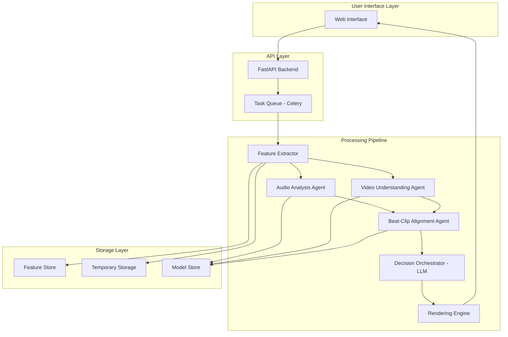

# Design Document: BeatSync AI

## Overview

BeatSync AI is an intelligent multi-agent video editing system that automatically synchronizes user-uploaded video clips to music beats. The system employs a pipeline architecture with specialized agents for audio analysis, video understanding, and beat-clip alignment, coordinated by an LLM-based orchestrator that makes final editing decisions.

### Architecture Philosophy

The system follows a **multi-agent architecture** where each agent specializes in a specific domain:
- **Audio Analysis Agent**: Extracts temporal and spectral features from music
- **Video Understanding Agent**: Analyzes visual content for motion and energy
- **Beat-Clip Alignment Agent**: Matches video segments to audio beats
- **Decision Orchestrator**: Synthesizes agent outputs into coherent editing decisions

This separation of concerns allows each agent to be developed, tested, and improved independently while the orchestrator handles the complex task of combining their insights.

### Processing Pipeline

```
User Upload → Feature Extraction → Agent Analysis → Orchestration → Rendering → Final Reel
     ↓              ↓                    ↓               ↓             ↓
  [Videos]    [Audio Features]    [Structured JSON]  [EDL]      [MP4 Output]
  [Audio]     [Video Features]    [Agent Outputs]    [Decisions]
```

### Technology Stack

- **Audio Processing**: librosa (beat detection, spectral analysis), aubio (onset detection)
- **Video Processing**: OpenCV (motion detection, scene changes), FFmpeg (decoding/encoding)
- **Machine Learning**: scikit-learn (initial models), PyTorch (future deep learning models)
- **LLM Orchestration**: OpenAI API or similar (structured output mode)
- **Video Rendering**: FFmpeg with Python bindings (ffmpeg-python)
- **Storage**: Feature vectors stored as NumPy arrays, metadata in JSON

## Architecture

### System Components



### Data Flow

1. **Upload Phase**: User uploads video clips and audio file through web interface
2. **Feature Extraction Phase**: System extracts audio and video features, stores only features (not raw content)
3. **Agent Analysis Phase**: Each agent processes features in parallel where possible
4. **Orchestration Phase**: LLM receives structured JSON from all agents and makes editing decisions
5. **Rendering Phase**: FFmpeg assembles final video based on edit decision list
6. **Cleanup Phase**: Temporary files deleted, only features retained for training

### Concurrency Model

- **Audio and Video Feature Extraction**: Run in parallel for different files
- **Agent Analysis**: Audio and Video agents run in parallel; Alignment agent waits for both
- **Rendering**: Single-threaded FFmpeg process (CPU-bound)
- **Queue Management**: Celery task queue handles multiple user requests

## Components and Interfaces

### 1. Feature Extractor

**Purpose**: Extract numerical features from uploaded media without storing raw copyrighted content.

**Audio Feature Extraction**:
```python
class AudioFeatureExtractor:
    def extract_features(self, audio_path: str) -> AudioFeatures:
        """
        Extract comprehensive audio features.
        
        Returns:
            AudioFeatures containing:
            - sample_rate: int
            - duration: float
            - waveform_hash: str (for deduplication, not storage)
        """
        pass
    
    def extract_beats(self, audio_path: str) -> List[float]:
        """Use librosa.beat.beat_track to detect beat timestamps."""
        pass
    
    def extract_bpm(self, audio_path: str) -> float:
        """Calculate tempo using librosa.beat.tempo."""
        pass
    
    def extract_energy_curve(self, audio_path: str, hop_length: int = 512) -> np.ndarray:
        """
        Extract RMS energy over time.
        Returns array of energy values with timestamps.
        """
        pass
    
    def detect_drops(self, audio_path: str, energy_curve: np.ndarray) -> List[float]:
        """
        Detect significant energy changes (drops/buildups).
        Uses spectral flux and energy derivative.
        """
        pass
```

**Video Feature Extraction**:
```python
class VideoFeatureExtractor:
    def extract_features(self, video_path: str) -> VideoFeatures:
        """
        Extract comprehensive video features.
        
        Returns:
            VideoFeatures containing:
            - clip_id: str
            - duration: float
            - fps: float
            - resolution: Tuple[int, int]
        """
        pass
    
    def calculate_motion_score(self, video_path: str) -> float:
        """
        Calculate motion intensity using optical flow.
        Uses Lucas-Kanade or Farneback optical flow.
        Returns normalized score 0-1.
        """
        pass
    
    def detect_scene_changes(self, video_path: str) -> List[Tuple[float, float]]:
        """
        Detect scene changes using histogram difference.
        Returns list of (timestamp, confidence) tuples.
        """
        pass
    
    def calculate_energy_score(self, video_path: str) -> float:
        """
        Calculate overall clip energy combining:
        - Motion intensity
        - Color saturation
        - Brightness variance
        Returns normalized score 0-1.
        """
        pass
    
    def identify_best_segments(self, video_path: str, segment_length: float = 2.0) -> List[Segment]:
        """
        Identify high-quality segments within clip.
        Considers motion, focus, and visual interest.
        """
        pass
```

**Privacy Compliance**:
- Raw video frames are processed in memory and never written to disk
- Only feature vectors (motion scores, energy curves) are persisted
- Audio waveforms are processed in chunks and discarded after feature extraction
- Temporary uploaded files are deleted immediately after feature extraction

### 2. Audio Analysis Agent

**Purpose**: Analyze audio features and provide structured output for beat synchronization.

**Interface**:
```python
class AudioAnalysisAgent:
    def __init__(self, feature_extractor: AudioFeatureExtractor):
        self.feature_extractor = feature_extractor
    
    def analyze(self, audio_path: str) -> AudioAnalysisOutput:
        """
        Perform complete audio analysis.
        
        Returns:
            AudioAnalysisOutput (JSON-serializable):
            {
                "bpm": float,
                "beat_timestamps": List[float],
                "energy_curve": List[Tuple[float, float]],  # (time, energy)
                "drop_timestamps": List[float],
                "confidence": float,
                "metadata": {
                    "duration": float,
                    "sample_rate": int
                }
            }
        """
        pass
    
    def refine_beat_detection(self, beats: List[float], bpm: float) -> List[float]:
        """
        Refine beat timestamps using BPM to correct false positives/negatives.
        Ensures beats are evenly spaced according to detected tempo.
        """
        pass
    
    def classify_beat_strength(self, audio_path: str, beats: List[float]) -> List[float]:
        """
        Classify each beat's strength (0-1).
        Strong beats (downbeats) are better cut points.
        """
        pass
```

**Algorithm Details**:

1. **Beat Detection**:
   - Use `librosa.beat.beat_track()` for initial beat detection
   - Apply onset strength envelope for refinement
   - Filter false positives using spectral flux
   - Ensure temporal consistency with detected BPM

2. **BPM Calculation**:
   - Use `librosa.beat.tempo()` with aggregate method
   - Validate against beat intervals
   - Handle tempo changes (use median BPM for consistency)

3. **Energy Curve Extraction**:
   - Calculate RMS energy with 512-sample hop length
   - Apply smoothing (moving average, window=0.1s)
   - Normalize to 0-1 range
   - Sample at 10Hz for efficiency

4. **Drop Detection**:
   - Calculate spectral flux (change in frequency content)
   - Detect peaks in energy derivative
   - Filter drops with minimum energy threshold
   - Classify as buildup, drop, or breakdown

### 3. Video Understanding Agent

**Purpose**: Analyze video content and provide structured output for clip selection and placement.

**Interface**:
```python
class VideoUnderstandingAgent:
    def __init__(self, feature_extractor: VideoFeatureExtractor):
        self.feature_extractor = feature_extractor
    
    def analyze(self, video_path: str, clip_id: str) -> VideoAnalysisOutput:
        """
        Perform complete video analysis.
        
        Returns:
            VideoAnalysisOutput (JSON-serializable):
            {
                "clip_id": str,
                "motion_score": float,
                "scene_changes": List[float],
                "energy_score": float,
                "best_segments": List[{
                    "start": float,
                    "end": float,
                    "score": float,
                    "characteristics": List[str]
                }],
                "metadata": {
                    "duration": float,
                    "fps": float,
                    "resolution": Tuple[int, int]
                }
            }
        """
        pass
    
    def analyze_temporal_consistency(self, video_path: str) -> float:
        """
        Measure how consistent motion/energy is over time.
        High consistency = good for longer clips.
        Low consistency = better for quick cuts.
        """
        pass
    
    def detect_faces_and_actions(self, video_path: str) -> List[Detection]:
        """
        Optional: Detect faces and actions for advanced matching.
        Can prioritize clips with faces for certain beat types.
        """
        pass
```

**Algorithm Details**:

1. **Motion Score Calculation**:
   - Use Farneback optical flow on downsampled frames (every 5th frame)
   - Calculate magnitude of flow vectors
   - Aggregate using mean and standard deviation
   - Normalize to 0-1 range

2. **Scene Change Detection**:
   - Calculate histogram difference between consecutive frames
   - Use threshold-based detection (adaptive threshold)
   - Filter false positives using temporal consistency
   - Return timestamps with confidence scores

3. **Energy Score Calculation**:
   - Combine multiple factors:
     - Motion intensity (40% weight)
     - Color saturation (30% weight)
     - Brightness variance (20% weight)
     - Edge density (10% weight)
   - Normalize each factor to 0-1
   - Weighted sum for final score

4. **Best Segment Identification**:
   - Slide window of specified length across clip
   - Score each window using energy score
   - Filter overlapping segments (keep highest scoring)
   - Return top N segments with characteristics

### 4. Beat-Clip Alignment Agent

**Purpose**: Match video clips to audio beats based on energy correspondence and timing constraints.

**Interface**:
```python
class BeatClipAlignmentAgent:
    def __init__(self):
        self.energy_matching_threshold = 0.3
        self.min_clip_duration = 0.2  # seconds
        self.max_clip_duration = 4.0  # seconds
    
    def align(
        self,
        audio_analysis: AudioAnalysisOutput,
        video_analyses: List[VideoAnalysisOutput],
        target_duration: Optional[float] = None
    ) -> AlignmentOutput:
        """
        Perform beat-clip alignment.
        
        Returns:
            AlignmentOutput (JSON-serializable):
            {
                "placements": List[{
                    "clip_id": str,
                    "trim_start": float,
                    "trim_duration": float,
                    "align_to_beat": float,
                    "energy_match_score": float
                }],
                "total_duration": float,
                "coverage": float,  # percentage of beats covered
                "metadata": {
                    "clips_used": int,
                    "clips_reused": int,
                    "average_clip_duration": float
                }
            }
        """
        pass
    
    def calculate_energy_match(
        self,
        clip_energy: float,
        beat_energy: float
    ) -> float:
        """
        Calculate how well a clip's energy matches a beat's energy.
        Returns score 0-1 (1 = perfect match).
        """
        pass
    
    def optimize_clip_duration(
        self,
        clip: VideoAnalysisOutput,
        beat_interval: float,
        next_beat_energy: float
    ) -> float:
        """
        Determine optimal clip duration considering:
        - Beat interval (prefer cuts on beats)
        - Energy trajectory (build or release)
        - Clip characteristics (scene changes, motion)
        """
        pass
    
    def handle_clip_reuse(
        self,
        available_clips: List[VideoAnalysisOutput],
        used_clips: Set[str],
        required_energy: float
    ) -> str:
        """
        Select clip for reuse when all clips have been used.
        Prioritize clips not recently used and matching energy.
        """
        pass
```

**Algorithm Details**:

1. **Energy Matching**:
   - Calculate absolute difference between clip energy and beat energy
   - Apply Gaussian kernel for soft matching: `exp(-diff^2 / (2 * threshold^2))`
   - Bonus for exact matches at drops (high-energy clips at drops)
   - Penalty for mismatches (low-energy clips at drops)

2. **Clip Duration Optimization**:
   - Base duration on beat interval (1, 2, or 4 beats)
   - Adjust for energy trajectory:
     - Rising energy: prefer shorter clips (build tension)
     - Falling energy: allow longer clips (release)
   - Respect scene changes (don't cut mid-scene unless intentional)
   - Ensure minimum/maximum duration constraints

3. **Timeline Construction**:
   - Iterate through beats in chronological order
   - For each beat, select best matching clip
   - Track used clips to ensure variety
   - Allow reuse after N other clips have been used
   - Ensure smooth energy flow (avoid jarring transitions)

4. **Clip Reuse Strategy**:
   - Maintain recency queue (least recently used)
   - Prefer clips with multiple good segments
   - Use different segments from same clip when reusing
   - Ensure minimum separation between reuses (at least 5 seconds)

### 5. Decision Orchestrator (LLM)

**Purpose**: Synthesize agent outputs and make final editing decisions using language model reasoning.

**Interface**:
```python
class DecisionOrchestrator:
    def __init__(self, llm_client, model: str = "gpt-4"):
        self.llm_client = llm_client
        self.model = model
    
    def orchestrate(
        self,
        audio_analysis: AudioAnalysisOutput,
        video_analyses: List[VideoAnalysisOutput],
        alignment: AlignmentOutput,
        user_preferences: Optional[UserPreferences] = None
    ) -> EditDecisionList:
        """
        Make final editing decisions.
        
        Returns:
            EditDecisionList:
            {
                "clips": List[{
                    "clip_id": str,
                    "start_time": float,
                    "end_time": float,
                    "trim_start": float,
                    "trim_end": float,
                    "transition": str,  # "cut", "fade", "wipe"
                    "effects": List[str]
                }],
                "audio": {
                    "start_time": float,
                    "end_time": float,
                    "fade_in": float,
                    "fade_out": float
                },
                "metadata": {
                    "total_duration": float,
                    "style": str,
                    "reasoning": str
                }
            }
        """
        pass
    
    def build_prompt(
        self,
        audio_analysis: AudioAnalysisOutput,
        video_analyses: List[VideoAnalysisOutput],
        alignment: AlignmentOutput,
        user_preferences: Optional[UserPreferences]
    ) -> str:
        """
        Build structured prompt for LLM with all agent outputs.
        """
        pass
    
    def parse_llm_response(self, response: str) -> EditDecisionList:
        """
        Parse LLM response into structured EDL.
        Use JSON mode for reliable parsing.
        """
        pass
    
    def apply_user_preferences(
        self,
        edl: EditDecisionList,
        preferences: UserPreferences
    ) -> EditDecisionList:
        """
        Adjust EDL based on user preferences:
        - Pacing: adjust clip durations
        - Style: adjust transitions and effects
        - Duration: trim or extend timeline
        """
        pass
```

**LLM Prompt Structure**:

```
You are a professional video editor creating a beat-synced reel.

AUDIO ANALYSIS:
- BPM: {bpm}
- Duration: {duration}s
- Beats: {beat_count} beats detected
- Drops: {drop_timestamps}
- Energy curve: [provided as time-series]

VIDEO CLIPS:
{for each clip:}
- Clip {clip_id}:
  - Duration: {duration}s
  - Motion score: {motion_score}
  - Energy score: {energy_score}
  - Best segments: {segments}

ALIGNMENT SUGGESTIONS:
{alignment placements with energy match scores}

USER PREFERENCES:
- Pacing: {fast/medium/slow}
- Style: {dramatic/smooth/energetic}
- Target duration: {duration}s

TASK:
Create an edit decision list that:
1. Synchronizes cuts to beats
2. Matches clip energy to beat energy
3. Ensures visual variety
4. Follows user preferences
5. Creates professional-looking transitions

Output a JSON edit decision list with clip placements, timing, and transitions.
```

**Decision Logic**:

1. **Validate Agent Outputs**: Ensure all JSON is well-formed and contains required fields
2. **Apply Constraints**: Enforce minimum/maximum clip durations, ensure beat alignment
3. **Optimize for Variety**: Avoid consecutive similar clips, ensure visual diversity
4. **Apply Style**: Adjust transitions and pacing based on user preferences
5. **Refine Timing**: Fine-tune clip boundaries for smooth flow
6. **Add Transitions**: Select appropriate transitions (cuts for fast-paced, fades for slow)

### 6. Rendering Engine

**Purpose**: Assemble final video from edit decision list using FFmpeg.

**Interface**:
```python
class RenderingEngine:
    def __init__(self):
        self.output_format = "mp4"
        self.video_codec = "libx264"
        self.audio_codec = "aac"
        self.preset = "medium"
        self.crf = 23  # Constant Rate Factor for quality
    
    def render(
        self,
        edl: EditDecisionList,
        video_clips: Dict[str, str],  # clip_id -> file_path
        audio_path: str,
        output_path: str,
        progress_callback: Optional[Callable[[float], None]] = None
    ) -> RenderResult:
        """
        Render final video from EDL.
        
        Returns:
            RenderResult:
            {
                "output_path": str,
                "duration": float,
                "file_size": int,
                "success": bool,
                "error": Optional[str]
            }
        """
        pass
    
    def build_ffmpeg_command(
        self,
        edl: EditDecisionList,
        video_clips: Dict[str, str],
        audio_path: str,
        output_path: str
    ) -> List[str]:
        """
        Build FFmpeg command for complex filter graph.
        Uses concat filter with trim and setpts.
        """
        pass
    
    def apply_transitions(
        self,
        filter_graph: str,
        transitions: List[Tuple[float, str]]
    ) -> str:
        """
        Add transition effects to filter graph.
        Supports: cut (no transition), fade, xfade (crossfade).
        """
        pass
    
    def monitor_progress(
        self,
        process: subprocess.Popen,
        total_duration: float,
        callback: Callable[[float], None]
    ) -> None:
        """
        Monitor FFmpeg progress and call callback with percentage.
        Parses FFmpeg stderr for time= output.
        """
        pass
```

**FFmpeg Filter Graph Construction**:

For a simple 3-clip example:
```
[0:v]trim=start=2.5:duration=1.0,setpts=PTS-STARTPTS[v0];
[1:v]trim=start=0.0:duration=1.5,setpts=PTS-STARTPTS[v1];
[2:v]trim=start=5.0:duration=2.0,setpts=PTS-STARTPTS[v2];
[v0][v1]concat=n=2:v=1:a=0[v01];
[v01][v2]concat=n=2:v=1:a=0[vout];
[3:a]atrim=start=0:end=4.5,asetpts=PTS-STARTPTS[aout]
```

**Rendering Process**:

1. **Prepare Inputs**: Validate all video clip paths and audio path exist
2. **Build Filter Graph**: Construct complex filter for trimming, concatenation, and transitions
3. **Execute FFmpeg**: Run FFmpeg with filter graph and monitor progress
4. **Handle Errors**: Catch FFmpeg errors and provide meaningful error messages
5. **Validate Output**: Ensure output file exists and has expected duration
6. **Cleanup**: Remove temporary files used during rendering

### 7. Model Training Pipeline (Future Enhancement)

**Purpose**: Train models to improve beat-sync quality over time.

**Models to Train**:

1. **Beat-Cut Prediction Model**:
   - Input: Audio features around beat (spectral, temporal)
   - Output: Probability that this beat is a good cut point
   - Architecture: Gradient Boosting or Random Forest initially
   - Training data: High-performing videos with labeled cut points

2. **Clip Suitability Model**:
   - Input: Clip features + beat features
   - Output: Suitability score (0-1)
   - Architecture: Neural network with embedding layers
   - Training data: Clip-beat pairs with engagement metrics

3. **Trim Optimization Model**:
   - Input: Clip features + beat context + previous clips
   - Output: Optimal trim duration
   - Architecture: Regression model (XGBoost or neural network)
   - Training data: Successful edits with duration labels

**Training Data Collection**:
```python
class TrainingDataCollector:
    def collect_from_video(self, video_url: str) -> TrainingExample:
        """
        Extract features from high-performing video.
        Does NOT store raw video, only features.
        
        Returns:
            TrainingExample:
            {
                "audio_features": AudioFeatures,
                "video_features": List[VideoFeatures],
                "cut_points": List[float],
                "clip_durations": List[float],
                "engagement_metrics": {
                    "views": int,
                    "likes": int,
                    "shares": int,
                    "completion_rate": float
                }
            }
        """
        pass
```

**Privacy Compliance**:
- Only extract and store numerical features
- No raw video frames or audio waveforms stored
- Features are anonymized (no user identifiers)
- Engagement metrics aggregated and anonymized

## Data Models

### AudioFeatures
```python
@dataclass
class AudioFeatures:
    sample_rate: int
    duration: float
    waveform_hash: str  # For deduplication only
```

### AudioAnalysisOutput
```python
@dataclass
class AudioAnalysisOutput:
    bpm: float
    beat_timestamps: List[float]
    energy_curve: List[Tuple[float, float]]  # (time, energy)
    drop_timestamps: List[float]
    confidence: float
    metadata: Dict[str, Any]
    
    def to_json(self) -> str:
        """Serialize to JSON for agent communication."""
        pass
```

### VideoFeatures
```python
@dataclass
class VideoFeatures:
    clip_id: str
    duration: float
    fps: float
    resolution: Tuple[int, int]
```

### VideoAnalysisOutput
```python
@dataclass
class VideoAnalysisOutput:
    clip_id: str
    motion_score: float
    scene_changes: List[float]
    energy_score: float
    best_segments: List[Segment]
    metadata: Dict[str, Any]
    
    def to_json(self) -> str:
        """Serialize to JSON for agent communication."""
        pass

@dataclass
class Segment:
    start: float
    end: float
    score: float
    characteristics: List[str]  # e.g., ["high_motion", "face_detected"]
```

### AlignmentOutput
```python
@dataclass
class AlignmentOutput:
    placements: List[ClipPlacement]
    total_duration: float
    coverage: float
    metadata: Dict[str, Any]
    
    def to_json(self) -> str:
        """Serialize to JSON for agent communication."""
        pass

@dataclass
class ClipPlacement:
    clip_id: str
    trim_start: float
    trim_duration: float
    align_to_beat: float
    energy_match_score: float
```

### EditDecisionList
```python
@dataclass
class EditDecisionList:
    clips: List[ClipDecision]
    audio: AudioDecision
    metadata: Dict[str, Any]
    
    def to_json(self) -> str:
        """Serialize to JSON for rendering."""
        pass
    
    def validate(self) -> bool:
        """Validate EDL for consistency and completeness."""
        pass

@dataclass
class ClipDecision:
    clip_id: str
    start_time: float  # Timeline position
    end_time: float
    trim_start: float  # Clip trim position
    trim_end: float
    transition: str  # "cut", "fade", "wipe"
    effects: List[str]

@dataclass
class AudioDecision:
    start_time: float
    end_time: float
    fade_in: float
    fade_out: float
```

### UserPreferences
```python
@dataclass
class UserPreferences:
    pacing: str  # "fast", "medium", "slow"
    style: str  # "dramatic", "smooth", "energetic"
    target_duration: Optional[float]
    transition_type: str  # "cuts", "fades", "mixed"
    
    @classmethod
    def default(cls) -> 'UserPreferences':
        """Return default preferences for general content."""
        return cls(
            pacing="medium",
            style="energetic",
            target_duration=None,
            transition_type="mixed"
        )
```

### RenderResult
```python
@dataclass
class RenderResult:
    output_path: str
    duration: float
    file_size: int
    success: bool
    error: Optional[str]
```

## Correctness Properties

*A property is a characteristic or behavior that should hold true across all valid executions of a system—essentially, a formal statement about what the system should do. Properties serve as the bridge between human-readable specifications and machine-verifiable correctness guarantees.*


### Property 1: File Format Validation
*For any* uploaded file, if the file extension is in the list of supported formats (MP4, MOV, AVI, WebM for video; MP3, WAV, AAC, M4A for audio), then the system should accept the file, otherwise it should reject with a descriptive error message.

**Validates: Requirements 1.1, 1.2**

### Property 2: File Size Enforcement
*For any* uploaded file, if the file size exceeds the configured maximum size limit, then the system should reject the upload and provide an error message indicating the maximum allowed size.

**Validates: Requirements 1.3**

### Property 3: Processing Enablement
*For any* upload session, when all required files (at least one video clip and one audio file) have been successfully uploaded, then the processing action should be enabled in the user interface.

**Validates: Requirements 1.5**

### Property 4: Beat Timestamp Precision
*For any* audio file processed by the Audio Analysis Agent, all returned beat timestamps should be floating-point numbers with millisecond precision (3 decimal places) and within the audio duration range [0, duration].

**Validates: Requirements 2.1**

### Property 5: BPM Range Validity
*For any* audio file processed by the Audio Analysis Agent, the calculated BPM should be within the reasonable range of 30-300 beats per minute.

**Validates: Requirements 2.2**

### Property 6: Energy Curve Normalization
*For any* audio file processed by the Audio Analysis Agent, the energy curve should contain time-energy pairs where all energy values are normalized to the range [0, 1] and time values are monotonically increasing.

**Validates: Requirements 2.3**

### Property 7: Drop Timestamp Validity
*For any* audio file processed by the Audio Analysis Agent, all drop timestamps should be within the audio duration and correspond to points of significant energy change in the energy curve.

**Validates: Requirements 2.4**

### Property 8: Agent Output Serialization Round-Trip
*For any* agent output (AudioAnalysisOutput, VideoAnalysisOutput, or AlignmentOutput), serializing to JSON and then deserializing should produce an equivalent object with all required fields present and values preserved.

**Validates: Requirements 2.5, 3.5, 4.5**

### Property 9: Motion Score Normalization
*For any* video clip processed by the Video Understanding Agent, the motion score should be a floating-point number in the range [0, 1] where 0 represents no motion and 1 represents maximum motion intensity.

**Validates: Requirements 3.1**

### Property 10: Scene Change Timestamp Validity
*For any* video clip processed by the Video Understanding Agent, all scene change timestamps should be within the clip duration and monotonically increasing.

**Validates: Requirements 3.2**

### Property 11: Clip Energy Score Normalization
*For any* video clip processed by the Video Understanding Agent, the energy score should be a floating-point number in the range [0, 1] representing overall visual intensity.

**Validates: Requirements 3.3**

### Property 12: Segment Validity
*For any* video clip processed by the Video Understanding Agent, all identified best segments should have start times less than end times, both within the clip duration, and segments should not overlap.

**Validates: Requirements 3.4**

### Property 13: Energy Correspondence
*For any* alignment output from the Beat-Clip Alignment Agent, clips with energy scores above 0.7 should be matched to beats with energy above 0.7, and clips with energy scores below 0.3 should be matched to beats with energy below 0.3 (high-energy clips to high-energy beats, low-energy clips to low-energy beats).

**Validates: Requirements 4.1, 4.2**

### Property 14: Beat Alignment Constraint
*For any* alignment output from the Beat-Clip Alignment Agent, all clip placement align_to_beat timestamps should exactly match one of the beat timestamps from the audio analysis output.

**Validates: Requirements 4.3**

### Property 15: Trim Bounds Validity
*For any* clip placement in the alignment output, the trim_start should be non-negative, and trim_start + trim_duration should not exceed the clip's total duration.

**Validates: Requirements 4.4**

### Property 16: Timeline Coverage
*For any* alignment output where insufficient clips are available for the song duration, the total duration of all clip placements should equal or exceed the target song duration through strategic clip reuse.

**Validates: Requirements 4.6**

### Property 17: Energy Match Prioritization
*For any* two clips with different energy match scores for the same beat position, the Decision Orchestrator should select the clip with the higher energy match score when all other factors are equal.

**Validates: Requirements 5.2**

### Property 18: Visual Variety Constraint
*For any* edit decision list produced by the Decision Orchestrator, no two consecutive clips should have the same clip_id (clips should not repeat consecutively).

**Validates: Requirements 5.3**

### Property 19: Duration Constraint
*For any* edit decision list produced by the Decision Orchestrator, the total duration (sum of all clip durations) should match the target duration (song duration or user-specified length) within a tolerance of 0.1 seconds.

**Validates: Requirements 5.5**

### Property 20: EDL Completeness
*For any* edit decision list produced by the Decision Orchestrator, it should contain all required fields (clips with timing, transitions, audio settings) and pass validation checks for consistency.

**Validates: Requirements 5.6**

### Property 21: Progress Reporting
*For any* long-running operation (upload, rendering, processing), progress callbacks should be invoked at least once per second with monotonically increasing progress percentages from 0 to 100.

**Validates: Requirements 1.4, 6.4, 8.3**

### Property 22: Output Format Compliance
*For any* successfully rendered video, the output file should be in MP4 format with H.264 video codec and AAC audio codec, verifiable through file format inspection.

**Validates: Requirements 6.5**

### Property 23: Privacy Compliance - No Raw Content Storage
*For any* processing operation, the persistent storage should never contain raw video frames or audio waveforms, only numerical features, embeddings, and metadata.

**Validates: Requirements 7.1, 7.3, 7.5, 9.1**

### Property 24: Temporary File Cleanup
*For any* processing operation (successful or cancelled), all temporary files created during processing should be deleted from temporary storage within 60 seconds of completion or cancellation.

**Validates: Requirements 7.2, 8.6**

### Property 25: Data Deletion Completeness
*For any* user data deletion request, after the deletion operation completes, querying the storage for that user's data should return no results (all features and metadata removed).

**Validates: Requirements 7.4**

### Property 26: Pipeline Ordering
*For any* processing request, the pipeline stages should execute in the strict order: feature extraction → agent analysis → orchestration → rendering, with each stage completing before the next begins.

**Validates: Requirements 8.1**

### Property 27: Error Propagation
*For any* pipeline stage that fails, the system should halt processing immediately, not execute subsequent stages, and report the failure with stage identification and error details.

**Validates: Requirements 8.2**

### Property 28: Completion Notification
*For any* successfully completed processing operation, the system should send a notification to the user containing a valid download link for the final reel.

**Validates: Requirements 8.4**

### Property 29: Cancellation Support
*For any* processing operation in progress, if a cancellation request is received, the system should stop processing within 5 seconds and clean up resources.

**Validates: Requirements 8.5**

### Property 30: Model Versioning
*For any* model update operation, the system should create a new version identifier, store the new model separately from previous versions, and support rollback to any previous version.

**Validates: Requirements 9.5**

### Property 31: Queue Ordering
*For any* sequence of processing requests submitted by multiple users, the requests should be processed in FIFO (first-in-first-out) order based on submission timestamp.

**Validates: Requirements 10.2**

### Property 32: Wait Time Estimation
*For any* queued processing request, when the queue contains N requests ahead of it, the system should provide a wait time estimate based on average processing time multiplied by N.

**Validates: Requirements 10.3**

### Property 33: Memory Management for Large Files
*For any* video file larger than 100MB, the system should process the video in chunks with maximum memory usage not exceeding 2GB at any point during processing.

**Validates: Requirements 10.5**

### Property 34: Corruption Detection
*For any* uploaded file that is corrupted or unreadable, the system should detect the corruption during validation and return an error message identifying the specific problematic file by name.

**Validates: Requirements 11.1**

### Property 35: Insufficient Content Handling
*For any* processing request where the total duration of all video clips is less than 50% of the song duration, the system should inform the user and suggest uploading additional clips before proceeding.

**Validates: Requirements 11.3**

### Property 36: Descriptive Error Messages
*For any* error condition (agent failure, rendering failure, validation failure), the system should provide an error message that includes: error type, affected component, and actionable guidance for resolution.

**Validates: Requirements 2.6, 3.6, 11.4**

### Property 37: Rendering Failure Recovery
*For any* rendering operation that fails, the system should preserve the edit decision list in storage and provide a retry option that uses the same EDL without re-running earlier pipeline stages.

**Validates: Requirements 11.5**

### Property 38: Resource Exhaustion Queueing
*For any* processing request received when system resources are exhausted (CPU > 90%, memory > 90%), the system should queue the request and notify the user with an estimated delay time.

**Validates: Requirements 11.6**

### Property 39: Pacing Preference Application
*For any* edit decision list created with user pacing preference specified, fast-paced preference should result in average clip duration < 1.5 seconds, medium-paced should result in 1.5-3 seconds, and slow-paced should result in > 3 seconds.

**Validates: Requirements 12.1**

### Property 40: Style Preference Application
*For any* edit decision list created with style preference "dramatic", at least 80% of clips placed at drop timestamps should have energy scores > 0.7 (emphasis on drops).

**Validates: Requirements 12.2**

### Property 41: Target Duration Matching
*For any* processing request with user-specified target duration, the final reel duration should match the target duration within 0.5 seconds by selecting an appropriate portion of the song.

**Validates: Requirements 12.3**

### Property 42: Transition Preference Application
*For any* edit decision list created with transition preference specified, the transitions used should match the preference: "cuts" should use only cut transitions, "fades" should use only fade transitions, "mixed" should use a variety.

**Validates: Requirements 12.4**

### Property 43: Default Settings Application
*For any* processing request with no user preferences specified, the system should apply default settings (medium pacing, energetic style, mixed transitions) equivalent to calling with explicit default preferences.

**Validates: Requirements 12.5**

## Error Handling

### Error Categories

1. **Input Validation Errors**
   - Invalid file formats
   - Oversized files
   - Corrupted files
   - Insufficient content

2. **Processing Errors**
   - Beat detection failure (no beats found)
   - Video analysis failure (corrupted video)
   - Agent communication errors
   - LLM API errors

3. **Resource Errors**
   - Memory exhaustion
   - Disk space exhaustion
   - CPU timeout
   - Queue overflow

4. **Rendering Errors**
   - FFmpeg execution failure
   - Codec errors
   - Output write errors

### Error Handling Strategy

**Validation Phase**:
- Fail fast on invalid inputs
- Provide specific error messages with file names
- Suggest corrective actions

**Processing Phase**:
- Catch exceptions at agent boundaries
- Log detailed error information for debugging
- Return user-friendly error messages
- Preserve partial results when possible

**Rendering Phase**:
- Validate EDL before rendering
- Monitor FFmpeg stderr for errors
- Preserve EDL for retry on failure
- Provide progress updates until failure

**Resource Management**:
- Monitor system resources before accepting requests
- Queue requests when resources are constrained
- Implement timeouts for all operations
- Clean up resources on error or cancellation

### Error Response Format

All errors should follow a consistent format:

```python
@dataclass
class ErrorResponse:
    error_type: str  # "validation", "processing", "resource", "rendering"
    component: str  # Which component failed
    message: str  # User-friendly message
    details: Optional[str]  # Technical details for debugging
    actionable_guidance: str  # What the user should do
    retry_possible: bool  # Whether retry might succeed
```

Example:
```json
{
    "error_type": "processing",
    "component": "Audio_Analysis_Agent",
    "message": "Unable to detect beats in the uploaded audio file",
    "details": "Beat detection confidence below threshold (0.15 < 0.30)",
    "actionable_guidance": "Try uploading a song with a clearer beat or rhythm",
    "retry_possible": false
}
```

## Testing Strategy

### Dual Testing Approach

BeatSync AI requires both **unit testing** and **property-based testing** for comprehensive coverage:

- **Unit tests**: Verify specific examples, edge cases, and integration points
- **Property tests**: Verify universal properties across randomized inputs

### Unit Testing Focus Areas

1. **Specific Examples**:
   - Test beat detection on known songs with verified beat timestamps
   - Test video analysis on sample clips with known characteristics
   - Test rendering with simple 2-3 clip examples

2. **Edge Cases**:
   - Empty audio files
   - Single-frame videos
   - Audio with no detectable beats (ambient music)
   - Videos with no motion (static images)
   - Extremely short clips (< 0.5 seconds)
   - Extremely long clips (> 10 minutes)

3. **Integration Points**:
   - Agent communication (JSON serialization/deserialization)
   - Pipeline orchestration (stage transitions)
   - FFmpeg integration (command generation and execution)
   - LLM API integration (prompt construction and response parsing)

4. **Error Conditions**:
   - Corrupted file handling
   - Network failures (LLM API)
   - Resource exhaustion
   - Cancellation during processing

### Property-Based Testing Configuration

**Library**: Use `hypothesis` for Python property-based testing

**Configuration**:
- Minimum 100 iterations per property test
- Each test tagged with feature name and property number
- Tag format: `# Feature: beatsync-ai, Property N: [property text]`

**Property Test Examples**:

```python
from hypothesis import given, strategies as st
import hypothesis

# Property 1: File Format Validation
@given(
    filename=st.text(min_size=1),
    extension=st.sampled_from(['.mp4', '.mov', '.avi', '.webm', '.txt', '.pdf'])
)
@hypothesis.settings(max_examples=100)
def test_file_format_validation(filename, extension):
    """
    Feature: beatsync-ai, Property 1: File Format Validation
    For any uploaded file, if the extension is supported, accept it, otherwise reject.
    """
    file_path = filename + extension
    result = validate_file_format(file_path, file_type='video')
    
    if extension in ['.mp4', '.mov', '.avi', '.webm']:
        assert result.is_valid
    else:
        assert not result.is_valid
        assert "format" in result.error_message.lower()

# Property 5: BPM Range Validity
@given(
    audio_features=st.builds(
        AudioFeatures,
        sample_rate=st.integers(min_value=22050, max_value=48000),
        duration=st.floats(min_value=10.0, max_value=300.0)
    )
)
@hypothesis.settings(max_examples=100)
def test_bpm_range_validity(audio_features):
    """
    Feature: beatsync-ai, Property 5: BPM Range Validity
    For any audio file, calculated BPM should be within 30-300 range.
    """
    # Mock audio file with features
    agent = AudioAnalysisAgent(feature_extractor)
    output = agent.analyze(mock_audio_from_features(audio_features))
    
    assert 30 <= output.bpm <= 300

# Property 14: Beat Alignment Constraint
@given(
    audio_output=generate_audio_analysis_output(),
    video_outputs=st.lists(generate_video_analysis_output(), min_size=3, max_size=10)
)
@hypothesis.settings(max_examples=100)
def test_beat_alignment_constraint(audio_output, video_outputs):
    """
    Feature: beatsync-ai, Property 14: Beat Alignment Constraint
    For any alignment output, all align_to_beat timestamps should match beat timestamps.
    """
    agent = BeatClipAlignmentAgent()
    alignment = agent.align(audio_output, video_outputs)
    
    beat_timestamps = set(audio_output.beat_timestamps)
    for placement in alignment.placements:
        assert placement.align_to_beat in beat_timestamps

# Property 19: Duration Constraint
@given(
    target_duration=st.floats(min_value=15.0, max_value=60.0),
    audio_output=generate_audio_analysis_output(),
    video_outputs=st.lists(generate_video_analysis_output(), min_size=5, max_size=15)
)
@hypothesis.settings(max_examples=100)
def test_duration_constraint(target_duration, audio_output, video_outputs):
    """
    Feature: beatsync-ai, Property 19: Duration Constraint
    For any EDL, total duration should match target duration within 0.1 seconds.
    """
    orchestrator = DecisionOrchestrator(llm_client)
    alignment = alignment_agent.align(audio_output, video_outputs, target_duration)
    edl = orchestrator.orchestrate(audio_output, video_outputs, alignment)
    
    total_duration = sum(clip.end_time - clip.start_time for clip in edl.clips)
    assert abs(total_duration - target_duration) <= 0.1
```

### Test Data Generators

For property-based testing, we need generators for complex data structures:

```python
import hypothesis.strategies as st

@st.composite
def generate_audio_analysis_output(draw):
    """Generate random but valid AudioAnalysisOutput."""
    duration = draw(st.floats(min_value=15.0, max_value=120.0))
    bpm = draw(st.floats(min_value=60.0, max_value=180.0))
    beat_interval = 60.0 / bpm
    
    num_beats = int(duration / beat_interval)
    beat_timestamps = [i * beat_interval for i in range(num_beats)]
    
    energy_curve = [
        (t, draw(st.floats(min_value=0.0, max_value=1.0)))
        for t in np.linspace(0, duration, 100)
    ]
    
    drop_timestamps = draw(st.lists(
        st.floats(min_value=0.0, max_value=duration),
        min_size=0,
        max_size=5
    ))
    
    return AudioAnalysisOutput(
        bpm=bpm,
        beat_timestamps=beat_timestamps,
        energy_curve=energy_curve,
        drop_timestamps=sorted(drop_timestamps),
        confidence=draw(st.floats(min_value=0.5, max_value=1.0)),
        metadata={"duration": duration}
    )

@st.composite
def generate_video_analysis_output(draw):
    """Generate random but valid VideoAnalysisOutput."""
    clip_id = draw(st.text(min_size=8, max_size=16, alphabet=st.characters(whitelist_categories=('Lu', 'Ll', 'Nd'))))
    duration = draw(st.floats(min_value=2.0, max_value=30.0))
    
    motion_score = draw(st.floats(min_value=0.0, max_value=1.0))
    energy_score = draw(st.floats(min_value=0.0, max_value=1.0))
    
    num_scene_changes = draw(st.integers(min_value=0, max_value=5))
    scene_changes = sorted([
        draw(st.floats(min_value=0.0, max_value=duration))
        for _ in range(num_scene_changes)
    ])
    
    num_segments = draw(st.integers(min_value=1, max_value=3))
    best_segments = []
    for _ in range(num_segments):
        start = draw(st.floats(min_value=0.0, max_value=duration - 1.0))
        end = draw(st.floats(min_value=start + 0.5, max_value=duration))
        best_segments.append(Segment(
            start=start,
            end=end,
            score=draw(st.floats(min_value=0.5, max_value=1.0)),
            characteristics=draw(st.lists(
                st.sampled_from(["high_motion", "low_motion", "face_detected", "action"]),
                min_size=0,
                max_size=2
            ))
        ))
    
    return VideoAnalysisOutput(
        clip_id=clip_id,
        motion_score=motion_score,
        scene_changes=scene_changes,
        energy_score=energy_score,
        best_segments=best_segments,
        metadata={"duration": duration, "fps": 30.0, "resolution": (1920, 1080)}
    )
```

### Testing Coverage Goals

- **Unit Test Coverage**: 80% code coverage minimum
- **Property Test Coverage**: All 43 correctness properties implemented as property tests
- **Integration Test Coverage**: All agent interactions and pipeline stages
- **End-to-End Tests**: At least 5 complete workflows with real media files

### Continuous Testing

- Run unit tests on every commit
- Run property tests (with reduced iterations) on every commit
- Run full property tests (100+ iterations) nightly
- Run end-to-end tests before releases
- Monitor test execution time and optimize slow tests

### Test Environment

- **Unit/Property Tests**: Mock file I/O, use in-memory data
- **Integration Tests**: Use small test media files (< 1MB)
- **End-to-End Tests**: Use realistic media files (5-10MB)
- **Performance Tests**: Use production-sized media files (50-100MB)

## Implementation Notes

### MVP Scope

For the initial MVP, focus on:

1. **Rule-based beat detection** using librosa (no custom ML models)
2. **Heuristic clip scoring** based on motion and energy
3. **Simple energy matching** without ML optimization
4. **Basic LLM orchestration** with GPT-4
5. **CPU-based processing** (no GPU acceleration)
6. **Simple transitions** (cuts and fades only)

### Future Enhancements

1. **Trained Models**:
   - Beat-Cut Prediction Model
   - Clip Suitability Model
   - Trim Optimization Model

2. **Advanced Features**:
   - Face detection and tracking
   - Action recognition
   - Personal creator style learning
   - Reinforcement learning from engagement metrics

3. **Performance Optimizations**:
   - GPU acceleration for video processing
   - Parallel processing of multiple clips
   - Caching of extracted features
   - Optimized FFmpeg filter graphs

4. **Additional Transitions**:
   - Wipes and slides
   - Zoom effects
   - Color grading
   - Beat-reactive effects

### Technology Decisions

**Why librosa for audio analysis?**
- Industry-standard library for music information retrieval
- Robust beat detection algorithms
- Extensive documentation and community support
- Python-native (matches our stack)

**Why OpenCV for video analysis?**
- Comprehensive computer vision library
- Efficient optical flow implementations
- Good Python bindings
- Wide adoption and support

**Why FFmpeg for rendering?**
- Industry-standard video processing tool
- Supports all common formats and codecs
- Powerful filter graph system
- Command-line interface easy to integrate

**Why LLM for orchestration?**
- Handles complex decision-making with context
- Can reason about aesthetic and creative choices
- Easily incorporates user preferences
- Flexible and adaptable to new requirements

### Deployment Considerations

- **Containerization**: Docker containers for consistent environments
- **Queue Management**: Celery with Redis for task queueing
- **Storage**: S3 or similar for feature storage, local SSD for temporary files
- **Monitoring**: Track processing times, error rates, queue lengths
- **Scaling**: Horizontal scaling of worker nodes for parallel processing
